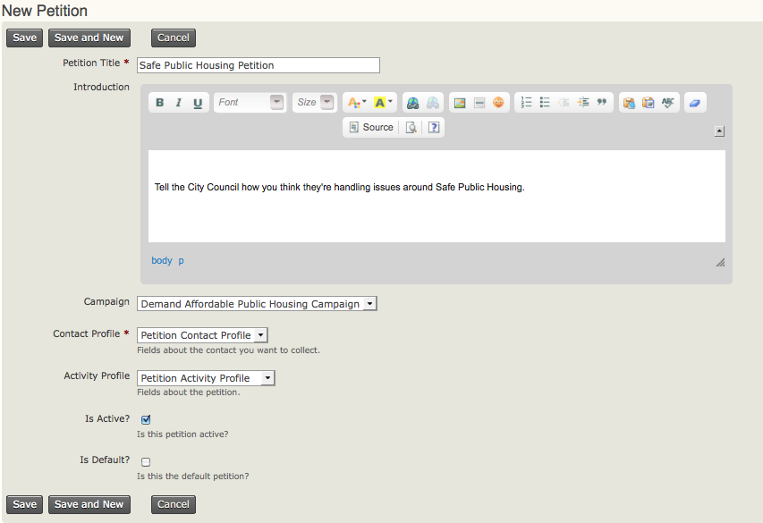

Configuration
=============

Ce chapitre décrit les étapes nécessaires pour la mise en place des pétitions.

Le composant CiviCampaign doit être activé avant d'utiliser les pétitions.
Pour plus de renseignements, voir la section *Campagne*.

Définir les autorisations dans le CMS
-------------------------------------

Vous devez définir les autorisations appropriées dans le CMS afin que des rôles spécifiques puissent signer la pétition.
En particulier, vous devrez accorder des autorisations aux utilisateurs anonymes, si vous planifiez de faire une pétition publique.

1. Aller dans la page pour le contrôle des accès de votre CMS, **Administrer > Utilisateurs et permissions > Permissions (contrôle d'accès)**.
2. Accorder les autorisations suivantes **Sign CiviCRM Petition**, **Profile Create** et **Access all Custom Data** aux rôles requis. Par exemple, si c'est une pétition publique, vous devez accorder ces autorisations aux utilisateurs anonymes et authentifiés.

Créer deux profils personnalisés
--------------------------------

Afin de créer une nouvelle pétition, vous devez créer deux profils personnalisés: un pour recueillir les informations du signataire (contact), et l'autre pour recueillir les réponses aux questions de la pétition.
Les réponses de la pétition sont conservées dans un enregistrement d'activité de type "Pétition" pour chaque signataire.

1. Aller à **Administrer > Personnaliser les données et écrans > Profils** et ajouter un profil et les champs des informations de contact que vous voulez recueillir, tels que Nom, Prénom et Courriel. Vous pouvez définir certains champs obligatoires pour recueillir assez d'information pour communiquer plus tard avec les signataires. 
  - Note: Pour le profil contact, vous devez recueillir au moins l'adresse de courriel, parce que la fonctionnalité de pétition enverra un courriel aux signataires pour les inciter à vérifier leur adresse de courriel. Seules les adresses de courriel vérifié peuvent être comptées.

2. Aller à **Administrer > Personnaliser les données et écrans > Données personnalisées** et ajouter des champs personnalisés pour recueillir les réponses aux questions de la pétition. 
  - À partir du menu déroulant **Utilisé pour**, sélectionnez **Activités**. 
  - Comme type d'activité, sélectionnez **Pétition Signature**.
3. Aller à **Administrer > Personnaliser les données et écrans > Profils** et ajouter un profil pour les réponses de la pétition. 
  - Sélectionnez **Activité** à partir du menu déroulant du champ **Nom**, puis sélectionnez les champs personnalisés que vous avez créés.

Pour les deux profils, vous pouvez sélectionner les paramètres suivants dans la section **Paramètres avancés**:

- Si vous ne voulez pas créer un compte Drupal aux signataires. Paramètre **Option d'enregistrement du compte d'utilisateur Drupal ?**, sélectionnez le bouton radio **Pas d'option de création de comptes**.
- Si vous ne voulez pas que les informations des utilisateurs anonymes écrasent les informations des contacts existants. Paramètre **Que faire en cas de correspondance des doublons**, vous pouvez sélectionner le bouton radio **Permettre la création de contacts en doublons**. Mais vous devrez gérer périodiquement les doublons.

Pour découvrir comment créer un ensemble de champs personnalisés, voir le chapitre *Creating Custom Fields* dans la section *Organising Your Data*. 

Pour découvrir comment créer un profil personnalisé, voir le chapitre *Profiles*.

Créer une nouvelle pétition
---------------------------

Lorsque vous avez créé les deux profils, vous êtes prêt à créer une pétition.

1. Aller à **Campagnes > Nouvelle pétition**, ensuite entrez les informations suivantes à votre pétition:
- **Titre de la pétition** (requis): entrer le nom de votre pétition.
- **Introduction**: entrer un texte qui décrit la pétition. Les signataires potentiels la liront, donc créez un bon message pour encourager les personnes à signer la pétition.
- **Campagne**: si votre pétition est une stratégie ou une activité d'une campagne alors, sélectionnez le nom de la campagne.
- **Profil du contact** (requis): sélectionnez le nom du profil qui recueillera les informations de contact des signataires.
- **Profil de l'activité**: sélectionnez le nom du profil de l'activité qui recueillera les répondes de la pétition.
- **Activer?** cochez cette case pour rendre la pétition active.
- **Valeur par défaut?** cochez cette case pour indiquer que la pétition est celle par défaut.

2. Cliquer sur **Enregister** pour sauvegarder les informations de la pétition.

