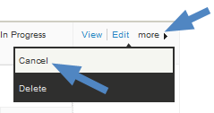

Everyday tasks
==============

Recording payments
-------------------

If a donor has chosen to use an offline payment method such as cash or
cheque, you will need to manually record the receipt of payment within
the pledge. To do this:

1.  Look up the contact in CiviCRM
2.  Go to the 'Pledges' tab within their contact record 
3.  Click the small arrow on the far left of the pledge to open up the
    scheduled pledge payments
4.  Find the next scheduled pledge payment and record the payment as
    paid.
5.  You can also edit the scheduled payment to alter either when the
    payment is due or the amount of the payment.

###Batch entry of pledges

The **Batch Data Entry** feature speeds up data entry when you have a
lot of pledge payments to record at one time. You enter payments using a
grid input screen where you can use the ‘autocopy’ icons at the top of
each column to quickly fill in field values. It also lets you verify the
total amount and count of items in the batch against the payments
recorded on your deposit slip(s).

During the batch data entry you can create new contacts on the fly. You
can save the batch and return later to continue entering payments. If
you have the appropriate permissions, you can also edit the total amount
and count of items in the definition of the batch if needed. 

**1. Create a new batch for data entry**

Create a new batch to hold the multiple payments you want to record:

From the menu, click on **Contributions > Batch Data Entry** then
select **New Data Entry Batch**.

 

Enter the following information:

-   **Batch Name**: CiviCRM will create a default batch name ("Batch N" + open date), which you can edit (required field)
-   **Type**: Select **Pledge Payment**. This selects the appropriate
    reserved profile to view in the batch entry grid screen. 
-   **Status**: the default will be “Open” (note: once a batch has a
    “closed status”, the batch will no longer be editable)
-   **Number of items**: total of payment items in the batch (required
    field)
-   **Total amount**: total amount of all the payment items in the batch
    (required field) 

You can edit or delete Batch information by going back to the **Bulk
Data Entry** screen then clicking on **Edit** or **Delete** next to the
batch you want.

 

**2. Enter Pledge Payments (check, cash, EFT, etc.)**

When you save information about the new batch, the batch data entry screen shown
above will appear and you can begin entering payments on each line as
follows;

-   **Contact.** You can:

    - start entering the name of an existing contact and CiviCRM will
    return a list of potential contact names for you to select, OR 
    -   create a new contact by clicking the drop-down box for “-create new
    contact-“ and selecting the type of contact you want to create:**New
    Individual, New Organization**, or **New Household** and enter the
    information about the contact here. 

    Note:  If contact information such as phone number or email address
    are included in the grid profile, those values will be populated for
    an existing contact and can be updated as needed. 

-   **Open Pledges:** Click on the down arrow to see all open pledges
    for the contact. You can assign the payment to any of the
    open(pending) pledges. 

-   **Type:**This is the Financial Type and pre-fills when an open
    pledge is selected.
-   **Amount:** This will pre-fill when you select an open pledge.  If
    you have the appropriate permissions, you can also alter the amount
    or schedule for the pledge payment. (Click on **adjust payment
    amount** next to the **Amount** field.) 
-   **(Payment) Status.**This defaults to**Completed**. 
-   **Received – Date and Time**  This pre-fills with the current date
    but can be edited. 
-   **Source**: Enter text that describes the source of the payment.
-   **Paid by**: Enter the payment instrument, e.g. cash, check, EFT,
    etc. This is a required field. 
-   **Check Number**: fill in if paid by check 
-   **Send Receipt: **check the box if you want to send a receipt via
    email
-   **Invoice ID**
-   **Soft Credit**
-   **Soft Credit Type**

**3. Validate and Process the Batch Totals or Save the Batch**

You can enter all transactions for the batch in one session, or simply
save the batch and complete the data entry at a later time. 
 
If you want to continue entering information into this batch at a later
time, click **Save & Continue Later**.

To find and add/edit more transactions into the batch later:

-   From the menu, click on **Contributions > Batch Data Entry** then
    click on **Enter Records** next to the batch you want.

Then continue entering more transactions in the batch. 

Once you are finished entering payments into a batch, click **Validate &
Process the Batch**. The status of the batch will be set to
“Closed” and will available for searches and reporting later.

If the total amount or count of items do not match the values you
entered when you created the Batch, you will be alerted when closing if
the count or total don't match. In this case, you either:

-   You can override the entered count and total by clicking**Ignore
    Mismatch & Process the Batch?** button, in which case the batch
    values are updated to match the transactions in the batch, and then
    the status of the batch will be set to “Closed”, OR
-   You can continue entering or editing the payments for the batch,
    then **Validate & Process the Batch** again. 

##Canceling pledges

Sadly, some pledges will not come to fruition. To cancel a pledge, find
it through a contact or the 'find pledges' search tool, use the 'more'
link to the right side of the pledge and click 'Cancel'.

