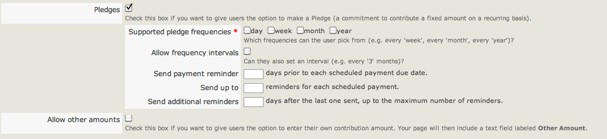
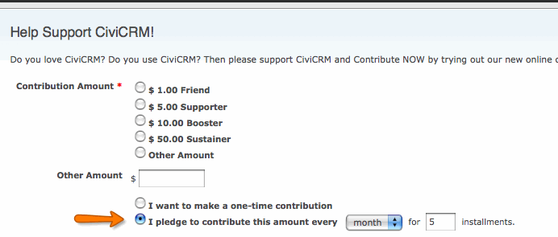

# Set-up

Within your online CiviContribute donation form, you may let your
constituents make pledges for future donations. By allowing pledges,
donors have the flexibility to choose the frequency with which they will
donate, e.g. twice a year, twice a month for five months, etc. Some
payment processors will not allow this kind of automation and the
payments themselves may arrive in a non-electronic form like cheques.
However, you can record future income against a current source such as
an event or email campaign, and change the status from 'pledged' to
'complete/paid' manually when the payment arrives (should the payment
method not support this). Pledges also provide an automated mechanism to
remind donors of their commitment.

For further information on pledges, and creating pledges internally on
behalf of constituents (i.e. not through an online form), see the
chapter 'Pledges'.

## Enabling pledges

Setting up pledges for online forms is a simple check-box affair. Once a
contribution page has been created (see the chapter 'Setup'), while
editing the page's settings go to the 'Amounts' tab and tick the option
'**Pledges**'. Several options will appear, as below.

-   **Supported pledge frequencies**: choose whether the donor can
    pledge a daily, weekly, monthly or annual donation.
-   **Allow frequency intervals**: if checked, donors will be able to
    specify a gap in payments (e.g. once every 5 days, 5 weeks, 5
    months, or five years).
-   **Send payment reminder**: if you wish to send the donor a reminder
    before their scheduled payment is due, enter the number of days
    prior to the payment that they will be reminded (e.g. via email)
-   **Send up to**: specify the maximum number of reminders an
    individual will receive for one scheduled payment.
-   **Send additional reminders**: set the interval period between
    reminders, by the number of days, e.g. 5 days before the next
    reminder is sent.
-   **Allow other amounts**: check this box if you wish to give
    individuals the option to pledge an amount of their choosing. You
    can also specify the minimum and maximum payment they can make.

Once enabled, the option to make a pledge will appear on the online
form. To check and monitor the current pledges, several reports and a
dashboard are available. To access the dashboard, go to:
**Contributions** > **Pledges** > **Dashboard.**

