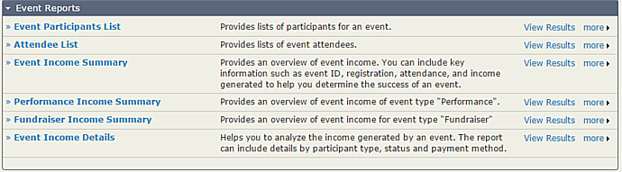
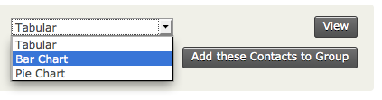
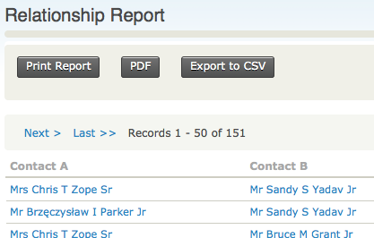
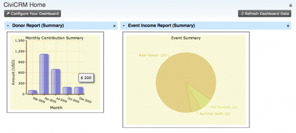
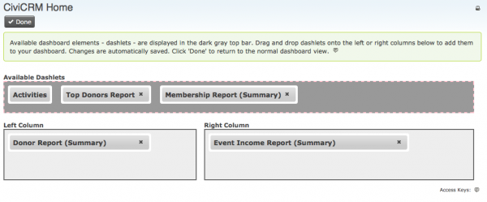
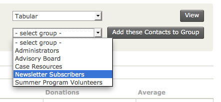

# Everyday Tasks

This chapter assumes that CiviReport is already configured and you are a
user wanting to access reports that have been configured for you. If you
want to learn more about how to set up and configure reports, read the
section on setting up CiviReport.

## Viewing reports

To view a report:

1.  Go to **Reports**.
2.  Select the relevant report type.
3.  Identify the report you wish to view. Click on **View Results** to view the report results using the preset criteria. Click on the report name to go to the criteria settings.

Reports can also be configured to be directly accessible from navigation
menus. For example, an event report can be configured to appear in the
**Events** menu.

When you open a report it will appear on screen as a table. Some reports
can also be viewed as a bar or pie chart. When this is the case, a
dropdown menu will allow you to select the format you want.

The appropriate report should then be displayed.

As well as viewing reports on screen you can create a PDF version of
either tables or graphs, suitable for printing or emailing.

If you want to perform further calculations on your report data, you can
output the data as comma separated variable (CSV) for import into a
spreadsheet by clicking **Export to CSV**.

If you have the appropriate permissions, you will be able to adjust the
report criteria and settings when you view the report. Read the section
configuring reports for detailed information about how to do this.

## Reports on your dashboard

Reports can be configured to appear on your dashboard (the first page
you see when you log in to CiviCRM). You can configure this yourself,
although not all reports may be available to put on your dashboard.

To display specific reports on your dashboard:

1.  From your dashboard, click on **Configure Your Dashboard**.
2.  Select a report from the list of available reports.
3.  Drag the report onto your dashboard.

## Adding report results to a group

Sometimes it is useful to add contacts returned in a report to a group.
This functionality isn't available in all reports but where it is, you
can choose the group you want to add the contacts to from the dropdown
menu as shown below.

