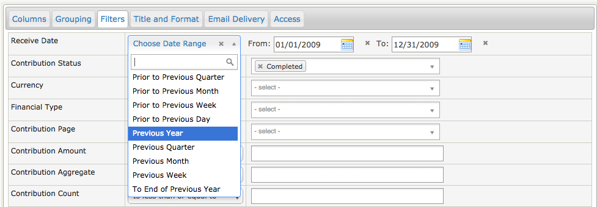
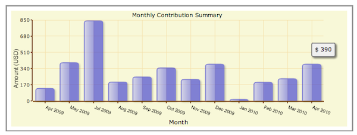
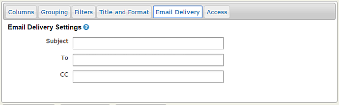
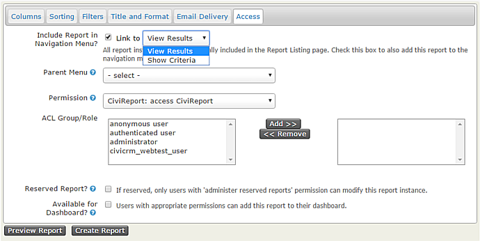
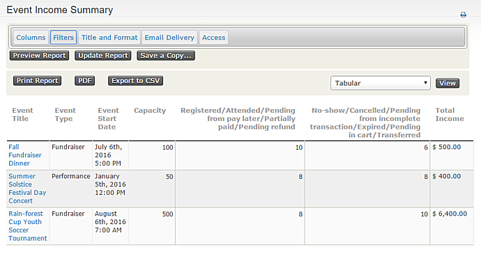

Set-up
======

This section explains how to set up CiviReports. It assumes a basic
understanding of why you would want to use CiviReport, and describes the
workflow for creating a report from a template through to making these
reports available for users. It also assumes that the report you require
can be achieved using the report templates supplied with CiviCRM.

If the report template you need does not exist you (or your developer)
should refer to the Custom Reports chapter in the Extensions section of
the Developer Guide for information about creating new templates.

Report templates
----------------

Report templates are general reports that can be further customised to
create specific report instances. These report instances can then be
made available to users.

The **Create new report from templates** page lists all available report
templates and is found in the **Administer > CiviReport** menu. The
templates are grouped by component, and each has a brief description of
its intended scenario. If there are already report instances for a given
template, you'll see a link to view **Existing Reports**.

Clicking on the report template name will bring up a screen where the
report can be configured.

There are two steps to configuring a report:

1.  Select your **report criteria**: decide what information will be
    displayed in the report.
2.  Define the **report settings**: choose a title, set permissions and
    add it to a menu. You will not see the report settings tabs until you have previewed the report.

Select report criteria
----------------------

When you create a new report you will be presented with two or more tabs
that will let you define the information the will be displayed in your
report. The tabs available will depend on the template you have selected
with the most common being:

-   **Columns** (all reports)
-   **Grouping** (summary reports)
-   **Sorting** (detail reports)
-   **Filters**(all reports)

The options available for these criteria change from report to report.
General principles for the different types of report criteria are
outlined below.

### Columns

These check boxes allow you to select the data to be displayed for each
record in your report. In most reports, at least one display column is
*required* and cannot be unselected. For example in the membership
detail report **Contact Name** and **Membership Type** are required
fileds

### **Grouping**

This is not available in all reports, but it is useful when creating a
report which summarises data, rather than displaying each individual
row, and for reports that compare different types of data.

For example you can choose to compare donations per year.

You can specify more than one grouping criteria. When you do this,
results will be nested based on both groupings. Not all combinations of
groupings will make sense for your data. You may need to spend time
experimenting with Group By Columns to become familiar with this
functionality.

Note that some Groups By Columns interact with Display Columns and can't
be selected at the same time. The system will warn you if you try to
make an invalid selection.

### Sorting

This is not available in all reports, but can be useful in "detail"
reports as shown below.

 

### Filters

Filters are the main way to specify the records that you want to include
in the report. For example, running the Membership Detail report without
choosing any filters will show you all membership records. You could
then filter the report to show all members of a specific membership type
who joined last year. Most filter are self-explanatory; the date range
filter is explained below.

**The Date Range Filter**

Most reports will have a date range filter. This can be configured in
two ways:

-   by using an absolute date range, e.g. "1st Jan 2010" to "31 July
    2010"
-   by using a relative date range, e.g. "Previous Year".

Relative date ranges are very useful for reports that you want to run on
an ongoing basis for example:

-   **This year** gives all records from the start of the current year.
-   **Previous quarter** gives all records from the previous quarter.
-   **Last 12 months** gives all records between one year earlier than
    today's date, and today (really useful!).

The "Last ..." ranges are particularly useful when used in combination
with Group By Columns. Combining Ending Year with Group By Month gives a
report that summarises data by month for the previous 12 months.

The report below shows the total amount of contributions received in the
past 12 months, as well as each month's
total.

Once you have selected your report criteria, click **Preview Report**.
(You will see that the tabs that define the report settings are now
visible.) If the information displayed isn't exactly what you wanted,
you can select the appropriate tab to modify your criteria. You may need
to make several modifications before you achieve the report you want.

Define Report settings
------------------------

Once you are happy with the report criteria you have entered into the
template, you need to save this criteria as a new report so that it can
be run again. (You will need to preview the report to make the settings tabs visible.)

1.  On the **Title and Format** tab give your report a title and
    description that will help other people understand its usage, for
    example, "Student members joined so far this year". A standard
    header and footer is included with each report and is displayed at
    the beginning and end of any PDF or downloaded versions of the
    report. These are written in HTML. If you want to display the
    actual report title replace "CiviCRM Report" between < title> and < /title>.
    You can include a logo be adding an < img> tag. You can also modify
    the look and feel of the printed report by including a custom CSS
    file (instead ofnprint.css)

2.  The **Email Delivery** tab contains the fields that will let you have
    report emailed to yourself or someone else on a regular basis. Fill
    in the Subject, To and CC fields in the Email Delivery Settings. You
    can enter one or more email addresses in the To and CC fields;
    multiple email addresses should be separated by commas.
  
    As well as entering the email delivery settings described above,
    the **Mail Reports (mail_report)** scheduled job must be enabled to
    send report emails. Alternatively a cron job can be scheduled to run
    this specific task apart from other scheduled jobs. The specific report
    instance and, optionally, format are specified as part of the scheduled
    job configuration. Refer to the *Scheduled Jobs* chapter for more
    information.

3.  All reports are included in **Report > Report listing**. On the **Access** tab, you can set if and where the report will appear elsewhere in the navigation menu. When you check **Include Report in Navigation Menu?** the Parent Menu field appears letting you select the parent menu for this second link to the report. The link to the report can either be to "View Results" or to "Show Criteria".  "View Results" will open the report to the results page and would be the appropriate choice for, say, a report that uses a relative date filter such as "Number of new contributors last calendar month".  "Show Criteria" will allow you to alter the report criteria before it is run.
    

    On the **Access** tab, you can also set up permissions to view or edit
    reports on a report-by-report basis. This allows you to simplify the
    user interface for junior users and set sensitive reports to be
    accessible only to certain users. For example, you might select
    "access CiviContribute" for contribution reports so that only the
    people that can see contribution data can access the report.

    Alternatively you can limit access to a report to (a) particular ACL
    role(s). Refer to the *Permissions and Access Control* in the *Initial
    Set Up* chapter.

    A **Reserved Report** can only be altered by someone with the
    **Administer Reserved Reports** permission.

    Checking the box **Available for Dashboard?** lets users with
    appropriate permissions add this report to their dashboard (this is
    done by clicking the **Configure Your Dashboard** button on the
    individual's dashboard).

Once the report criteria and settings are correct click **Create Report**. The report will now appear in **Reports > All Reports** as well as in any navigation menu you defined on the Access tab.

### Editing or copying an existing report

Sometimes you need to permanently alter the criteria for an existing report. Open the report, make the required changes and then click **Update Report** to save them.

At other times you may want two or more reports displaying the same columns of information but using different filters.  For example you may want an Event Income Summary report showing the income for all events for the events manager, but may only want the fundraising manager to have access to a report showing income from Fundraiser events. Once you have created the initial report you can open it, change the filtering criteria and click on **Save a Copy...**.  You will be prompted to enter a new title and description for the new report.

CiviReport Permissions
----------------------

There are four permission specifically associated with reports:

-   **CiviReport: access CiviReport** - user can view the CiviReport
    menu, but can only view reports set with the access CiviReport
    permission
-   **CiviReport: access Report Criteria** - user can change report
    search criteria
-   **CiviReport: administer reserved reports** - user can edit all
    reserved reports
-   **CiviReport: administer reports** - user can manage report
    templates
