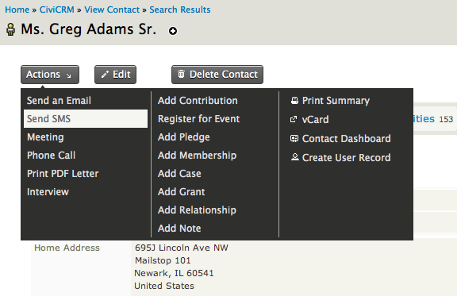
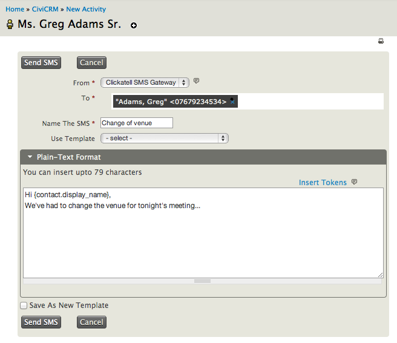
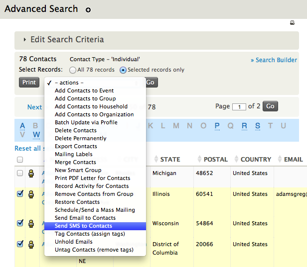
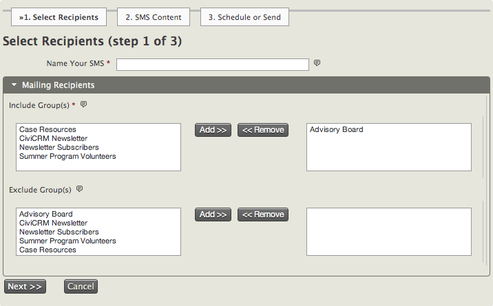
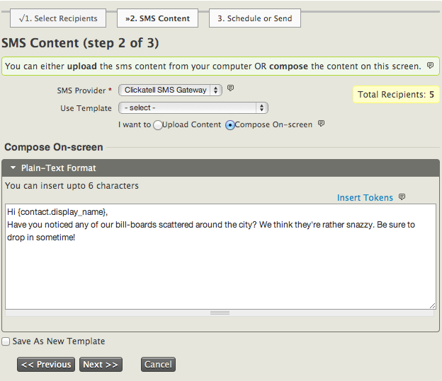
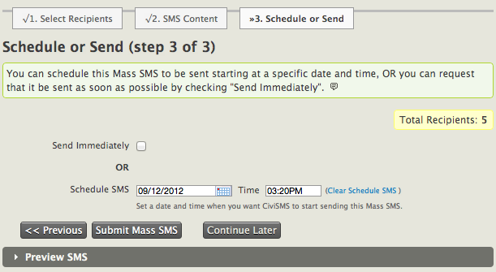

Tâches quotidiennes
===================

Nous supposons que vous avez déjà configuré un fournisseur SMS dans CiviCRM, et que vous êtes prêt, soit à tester l'envoi d'un SMS, ou à collaborer avec vos contacts. Si ce n'est pas encore fait, vous devez configurer la passerelle SMS (voir section "Configuration"). 

Envoi de messages texte
-----------------------

Les messages SMS peut être envoyés à des listes diffusion ou par envoi regroupé, ou à des personnes sélectionné manuellement.

### Messages destinés à quelques personnes

Si vous souhaitez envoyer un message texte à un individu, accéder au profil du contact, cliquer sur le bouton "Actions" et sélectionner l'option "Envoi SMS". Vous pouvez aussi créer un SMS à partir de l'onglet "Activités" du contact en sélectionnant une nouvelle activité dans le menu déroulant "Nouvelle activité".

Une nouvelle page va apparaître dans laquelle vous pourrez écrire votre message:

- **De**: sélectionner un fournisseur SMS par lequel vous souhaitez envoyer ce message.
- **À**: ce champ est automatiquement rempli avec le numéro du téléphone mobile des contacts sélectionnés dans l'écran précédent,  cependant vous pouvez ajouter d'autres destinataires en saisissant leur nom après le premier numéro, sélectionner le nom parmi la liste suggérée. Notez que les contacts sans numéro de téléphone mobile n'apparaîtront pas dans la liste (le numéro de téléphone doit être de type "Mobile").
- **Nom du SMS**: ce nom apparaîtra comme une activité de type SMS dans les profils des destinataires (contacts). Donnez-lui un nom approprié qui plus tard, vous permettra de le différencier des autres.
- **Utiliser un modèle**: si un modèle est déjà créé, vous pouvez l'ajouter ici pour épargner du temps (pour plus d'informations, voir «Configuration» dans le chapitre «Courrier électronique»).
- **Format texte**: dans le contenu du message, vous pouvez saisir un texte de 160 caractères maximum . Comme avec les courriers électroniques, vous pouvez ajouter des jetons pour insérer des informations du contact.
- **Sauvegarder en tant que nouveau modèle**: le message écrit peut être sauvegardé et réutilisé plus tard comme modèle.

Finalement, lorsque le SMS est envoyé, un message de confirmation apparaîtra et une activité de type SMS sera publiée dans le profil du destinataire (contact). Pour le voir, accédez au contact, allez à l'onglet "Activité" et parcourez la liste des activités de type "Message texte (SMS) envoyé". Cliquer sur "Consulter" pour voir plus de détail, incluant le contenu du message et la campagne.

### Envoi massif de SMS

Vous pouvez envoyer un SMS personnalisé à plusieurs personnes en même temps. Avant de commencer l'écriture de votre message, vous aurez besoin de la liste des destinataires. Si le message est utilisé une fois, vous pouvez exécuter une recherche avancée pour sélectionner les participants. Dans la liste, sélectionner les contacts et ensuite sélectionner "Envoyer un SMS aux contacts" dans le menu déroulant "Actions". Noter que le type d'activité de cette méthode sera "Message texte (SMS) envoyé".

Sinon, si vous souhaitez envoyer massivement des messages texte au même groupe de contacts sur une base régulière, vous pouvez utiliser une liste d'envoi. Si vous en avait pas encore défini, ou si vous souhaitez rafraichir votre  mémoire, lire la section "Configuration" dans le chapitre "Courrier électronique".

Pour écrire un SMS regroupé, aller à **Envois massifs** > **Nouveau SMS**. Il y a trois étapes à compléter:

1.  **Nommez votre SMS et sélectionnez les destinataires** 

    Premièrement, donner un nom au message texte. Il apparaîtra comme activité de type SMS dans le profil des destinataires (contacts), un sujet clairement défini vous aidera à l'identifier plus tard. Vous aurez besoin de sélectionner vos destinataires, sélectionnez les groupes que vous voulez inclure, déplacez les groupes de la boîte de gauche vers celle de droite en utilisant le bouton "Ajouter". Vous pouvez aussi spécifier les groupes que vous ne voulez pas inclure; les contacts qui sont dans les deux groupes ne recevront pas le message. Cliquer sur Suivant.

2.  **Contenu SMS**

    Avant d'écrire le message, sélectionnez un fournisseur SMS et décidez si un gabarit sera utilisé pour le contenu du SMS (voir "Configuration" dans le chapitre "Courrier électronique").

    Le contenu du message peut être écrit manuellement dans la section "Composer sur la page", ou téléchargé d'un fichier texte, cependant gardé à l'esprit que la limite de caractères pour les deux est de 160 (longueur d'un message de texte).
Vous pouvez aussi ajouter des jetons pour personnaliser le SMS insérant de l'information sur le contact dans le message.
Une fois écrit, si vous voulez réutiliser le message plus tard, cocher la boîte "Sauvegarder en tant que nouveau modèle" avant de continuer dans le prochain écran.

3.  **Planifier ou Envoyer** 

    Vous avez l'option d'envoyer le message immédiatement, ou planifier son envoi automatiquement à une date et à une heure donnée. Si vous ne souhaitez pas le faire maintenant, vous pouvez cliquer sur "Continuer plus tard" pour sauvegarder votre progression et prendre la décision plus tard. Pour retourner au message, aller à **Envois massifs** > **Envois massifs brouillons et non-programmés**, cocher l'option "Is SMS" et cliquer sur le bouton "Rechercher". La liste des messages texte non envoyés apparaît, simplement cliquer sur "Continuer" à la droite du message que vous voulez compléter.

   Finalement, vous pouvez cliquer dans la fenêtre "Prévisualiser SMS" située en bas pour vérifier le contenu, ou sélectionner "Soumettre le SMS groupé" pour envoyé votre message.

