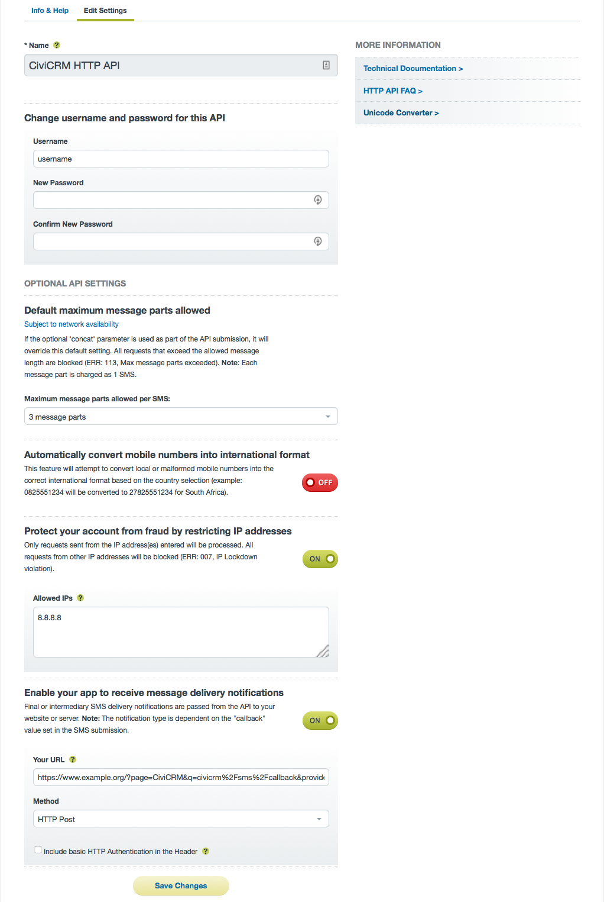
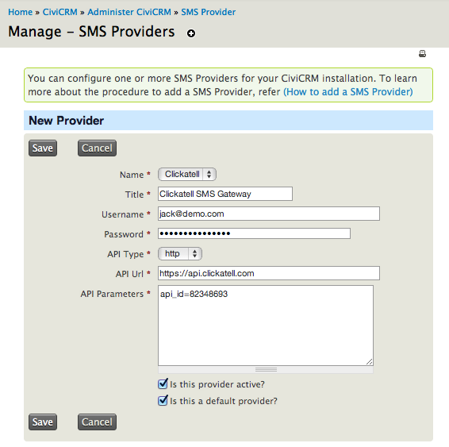

Set-up
======

In this chapter, the steps required to set up an SMS gateway will be
explored. Once configured, you will be able to send text messages to
individual contacts and mass mailing lists within CiviCRM.

Configuring a Clickatell SMS Gateway
------------------------------------

### Registering for a Clickatell account

The Clickatell service is an online SMS gateway designed for the sending
of text messages via the Internet. They offer several products, but here
we are only interested in the "Developer's Central" SMS gateway, as it
offers more advanced tools needed to link it to CiviCRM (this is
achieved through APIs; see the CiviCRM developer guide for more
information). Registering for a Clickatell account is free, and they
supply 10 complimentary credits to try the service. To sign up, visit:

[http://www.clickatell.com/register/](http://www.clickatell.com/register/)

Once you have registered for a Developer's Central account, please
sign-in and follow the steps below (when logging in you must select
"Central API" as the product and enter your Client ID):

1.
In the Central Home dashboard, click "Create a new Connection" under
"Connection Status" (New language is "Get another API". Page looks also changed.)



1.
Select "HTTP/S" as the connection type (New language: HTTP API)

1.
Four optional settings will appear, including:
    -   Description: change the name of the connection (e.g. "CiviCRM HTTP")
    -   Replace leading zero: enable this option if phone numbers against
        your contacts begin with "0". For delivery to be successful, all
        numbers must begin with the country code if this is not enabled.
        (This option no longer exists.)
    -   Enable IP Address Restriction: if you know the IP address of your
        CiviCRM server, you can enter it here to ensure that text messages
        cannot be sent using your account elsewhere (your username and
        password would be needed to do this)
        (New language:  "Protect your account from fraud by restricting IP addresses")
    -   Enable your app to receive message delivery notifications (New option?)
        Enter the correct URL for your site. Example:
        Drupal: http://www.example.com/civicrm/sms/callback?provider=org.civicrm.sms.clickatell
        Wordpress: https://www.example.org/?page=CiviCRM&q=civicrm%2Fsms%2Fcallback&provider=org.civicrm.sms.clickatell


1.
Click "Submit and Get API ID" to generate an API ID, and on the next
page, make a note of it.

### Completing the SMS Provider settings in CiviCRM

You now have all of the information needed to configure SMS in CiviCRM.
To continue, return to CiviCRM and go to: **Administer** > **System
Settings**> **SMS Providers**. Click "Add New Provider".



Complete the following settings:

-   Name: select "Clickatell"
-   Title: give the SMS provider a title user's will see (e.g.
    "Clickatell SMS")
-   Username: enter your Clickatell username
-   Password: and your Clickatell password
-   API type: select "http"
-   API URL: type the URL as follows: https://api.clickatell.com
-   API Parameters: this is where you should provide your API ID. The
    format required is: `api_id=8473658`
-   Is this provider active?: tick to enable the SMS gateway
-   Is this a default provider?: check this option to make it the
    default, where multiple SMS providers are available

CiviCRM will now be configured to send text messages to your contacts.

### Testing the SMS gateway

You can begin testing the gateway using the methods laid out in the
chapter "Everyday tasks". However, please note that if you are using the
10 complimentary SMS credits which came with the account, until you have
purchased credits Clickatell will replace the content with thank you
text like the message below:

```
Thanks for testing Clickatell's gateway coverage. You will be able to change the content of your message after your initial purchase of message credits.
```

### After upgrading your ClickAatell account to a paid account

Once you have upgraded your Clickatell account, you will need to change a
few parameters to get things working again.
In CiviCRM,  go to: **Administer** > **System Settings**>
**SMS Providers** and click Edit on your "Clickatell" provider. In the API
Parameters box, under the api_id line, add a from= and a mo=1 parameter.  The
from= number is the phone number associated with the api_id in your Clickatell
account.

Your API parameters should now look like:
```
api_id=8473658
from=15551234567
mo=1
```

Back in your ClickATell Developer's Central page, click on the America's 2 Way SMS
tab, then click Manage next to the phone number you are working with.  For the
Primary Callback:  Reply Path, choose "HTTP Get" from the dropdown.  In the target
address, enter the same address as used before:
Drupal: http://www.example.com/civicrm/sms/callback?provider=org.civicrm.sms.clickatell
Wordpress: https://www.example.org/?page=CiviCRM&q=civicrm%2Fsms%2Fcallback&provider=org.civicrm.sms.clickatell
