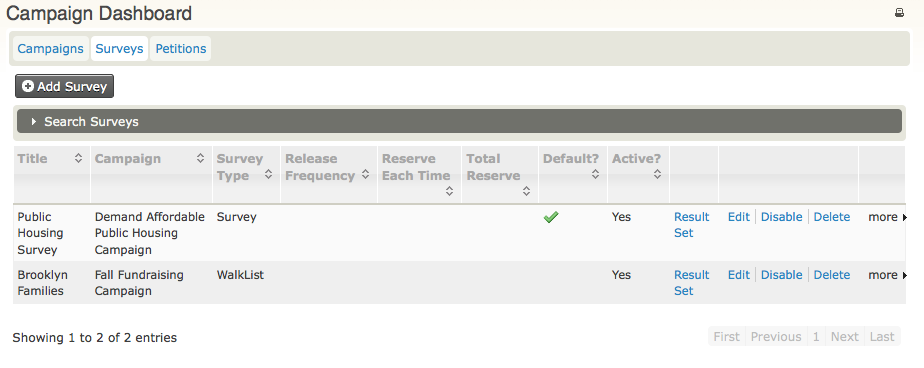
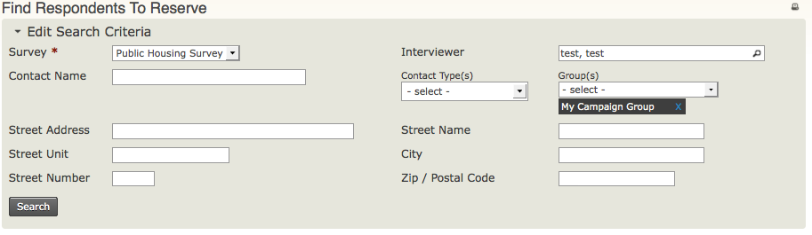
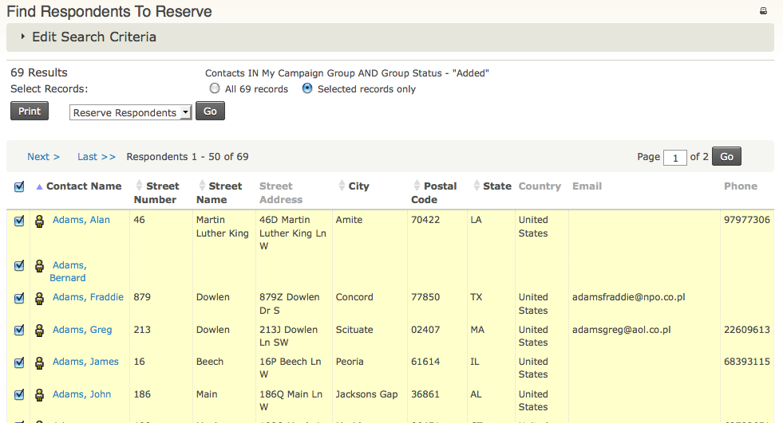
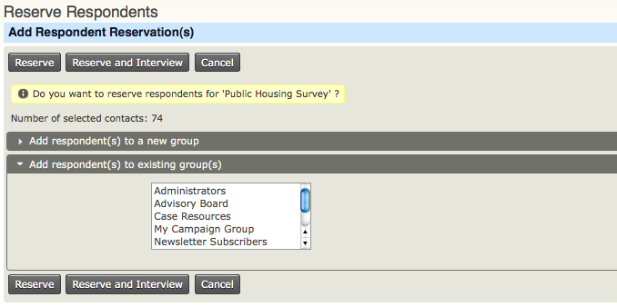

Everyday Tasks
==============

Managing Your Surveys
---------------------

To view and edit existing surveys, go to**Campaign > Dashboard >
Surveys**. Here you will find a summary of your surveys.

Use the links at the right to manage existing surveys, or click **Add
Survey** to create a new survey. 

**Reserving Respondents**

Before conducting a survey, you need to determine the group of
individuals you want to interview; in CiviCRM this is called reserving
respondents.

The reserved group can be divided into smaller subsets, as this may be a
more manageable number of contacts to interview within available time
periods.

To learn more about how to create a group, see the chapter called *Groups
and Tags*. 

To reserve a group of respondents:

1.  Go to **Campaigns > Reserve Respondents.**
2.  From the **Survey** dropdown menu select the name of the
    survey (required).
3.  From the **Group(s)** dropdown menu select the name of the group of
    the contacts to be interviewed.
4.  You can enter additional criteria to limit your search to a
    geographic area, such as Street Address, Street Name, Street Unit,
    Street Number, City, Zip/Postal Code. (Note: CiviCRM will parse a
    street address into Street Name, Street Unit, Street Number - which
    is extremely useful if you're planning a large door-to-door canvass
    - only if you turn on address parsing by clicking on **Administer >
    Administration Console> Configuration Checklist > Address
    Settings**, then in the **Address Editing** area, check the box for
    **Street Address Parsing**.)
5.  Click **Search.**

**

On the Find Respondents to Reserve search results screen, select the
contacts to be reserved for interviewing:

1.  Select the individuals to be reserved for surveys by checking the
    individual contacts to be interviewed (or select all of the contacts
    by clicking the radio button for **All *n* records** (where *n* is
    the number of contacts found in the reserve respondents search).
2.  Click **Go** to reserve the respondents.

**

 

On the Reserve Respondents screen, click **Reserve**. 

** 

Interview Respondents
---------------------

1.  To interview respondents Click **Campaign > Interview
    Respondents**.
2.  On the **Find Respondents to Interview** screen use the same
    criteria as for Reserve Respondents:

     -   **Survey:** (required) select the name of the survey
     -   **Group(s)**: select the name of the group of the contacts to be
        interviewed
     -   click **Search**.

1.  On the search results screen, either select the individuals to
    record responses, or select **All *n* records** (where *n* is the
    number of contacts found in the reserve respondents search).
2.  Click **Go** to record survey responses. 
     
3.  On the Record Survey Responses screen for each individual, record
    the responses to the questions. 
4.  In the **Result** column, select the status of responses to the
    survey. Like 'Completed, No Answer'. 
5.  Click **Record Response,**then choose one of the following:

 -   Click **Done** if you have finished recording the responses and
     return to the Find Respondents to Interview screen. 
 -   Click **Release Respondents** if you decide not to record
     responses for the contacts; then on the Release Respondents
     screen, click **Release Respondents** so they will no longer be
     reserved and another volunteer can reserve the contacts to be
     interviewed.
 -   Click **Reserve More Respondents** to find more contacts to be
     interviewed.

 

### **Reviewing Results of the Survey**

At the end of the canvass, a program lead may want to review the results
of the survey. Refer to the chapter Reports and Analysis to learn how to
view this report.

How to create a list of addresses for Surveys of type Walklist
--------------------------------------------------------------

Surveys allow you to easily print walk lists for your volunteers or
staff who are doing door-knocking activities and want to conduct a
survey at the door.

Door-knocking canvass activities may be one strategic activity that's
part of a larger campaign, so you may want to set up a Campaign if you
haven't done so already. 

**Create your WalkList report**

1.  Go to **Reports > Create Templates from Reports > Survey Report
    (Detail)**.
2.  In the **Display Columns** area, check the boxes for: **Street
    Number, Street Name, Street Unit, Survey Responses**.
3.  In the **Group By Columns** area, check the boxes for: **Street
    Name, Odd/Even Street Number**.
4.  In the **Set Filters** area, select your survey name in **Survey**,
    and for **Respondent Status** select **Is Equal
    to** and **Reserved** from the dropdown menus.
5.  Click **Preview Report**, then **Print Preview**.   
6.  **Print your report.** You will see that the print out includes a
    cover sheet with the survey questions (both label and value) and
    and that the report is sorted by street name and odd and even street
    numbers. See the chapter *Survey > SetUp* for more information. 

### **Conduct your door-knock canvass**

Your organisers and volunteers are now ready to door-knock and collect
responses on their WalkList report sheets. 

### **Recording responses from the canvass**

At the end of each day or evening of canvassing, each organiser or
volunteer can record the responses directly into CiviCRM.

1.  Go to **Campaigns > Interview Respondents**.
2.  Enter the name of your survey and the name of the target group you
    surveyed during the canvass; you may also enter the street name if
    you want to work with a smaller group of contacts to record
    responses. 
3.  On the **Find Respondents to Interview** screen, select the contacts
    for whom you want to record responses.
4.  Click **Go**.
5.  Enter the responses and results according to your WalkList sheet
    responses, then click **Record Response**. 

