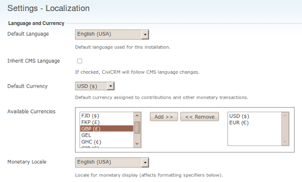

# Localising CiviCRM

CiviCRM is written with English-language code and strings for display.
It has, however, also been built for organisations worldwide. They need
to be able to adapt the tool to local circumstances and demands without
modifying the tool technically.

Localising CiviCRM (or any software) affects much more than you might
initially think. To adapt CiviCRM to a local language is not just a
matter of translating the text displayed on the screen. Consider for
example the currency used in a given country (USD or $ in United
States, GBP or £ in Great Britain), date and time formats (for example:
November 16th, 2009 will be commonly written as 11/16/2009 in United
States, but in Russia the format will be 16.11.2009) or the formatting
of numbers (the same number will be written slightly differently in
different countries: 1 234 567,89 in Slovakia or Hungary, but
1,234,567**.**89 in Japan or the United States).

CiviCRM provides plenty of functionality to support these language and
region specific needs. The development team is constantly developing new
tools in this area too. The Localization screen (shown in the following
screenshot) lets an administrator select the right locale for the
language and country of the organization using CiviCRM. Go to:
Administer > Configure > Global Settings > Localization.

## Translations

CiviCRM accommodates different languages, however the developers rely on
the community to translate the text displayed.

A number of languages have already been provided to a greater or lesser
extent. Some have more than 90% of the text translated, others only 5%,
and a number of languages have not been translated at all. Please check
the online translation tool [Transifex](https://www.transifex.com/civicrm/civicrm/dashboard/) to find out about your language of interest. Download and install it on
your CiviCRM installation to find out how well it will suit your needs.

You may find that although the translation is correct, you would want to
use different terms in your situation. You are very much encouraged to
take part in the translation of your language.

## Facilities

A number of facilities in CiviCRM support the community in its
translation efforts, though some are still under development.

1.  Transifex is an online tool that enables groups of translators to
    translate strings of text and keep an overview on its progress.
    Register there, look for your language, join the team or, if your
    language is not available, start translating.
2.  A [glossary](https://wiki.civicrm.org/confluence/display/CRM/Glossary+for+translations)
    on CiviCRM's wiki will help you maintain consistency in your
    translations. It will also help you get some insight on how much
    work it will be to translate those strings of text that your users
    will most often see and that would therefore be the first to
    translate.
3.  A [tips and tricks](https://wiki.civicrm.org/confluence/display/CRMDOC/Localisation+community+building+howto) wiki page
  explains how to set up your localization community.
4.  A [FAQ page](https://wiki.civicrm.org/confluence/display/CRMDOC/Internationalisation+FAQ) on the CiviCRM wiki covers localisation.

## Getting Started

Feel like helping translating CiviCRM to a new language or improving the
current translation? Here's how to do it (provided you have a bit of a
technical background):

1.  Go to transifex.net and create an account.
2.  Look for your language [here](https://www.transifex.com/civicrm/teams/)
    and either join a team, or request the creation of a new one if
    needed.
3.  Start translating!

### Team work

The CiviCRM translation work flow is still a work-in-progress and until
the process becomes more mature, you should probably refer to
[this page](https://lab.civicrm.org/development-team/translations/wikis/home)
for the most current instructions.

The work flow is heavily based on teamwork. Hopefully, there is already
a team of translators for your language that you can join. This team
will have built a glossary, will have started a translation set and will
be able to review your translations and give constructive criticism. If
such a team does not yet exist, the opportunity is all yours to create
one.

## Components and files

There are quite a lot of strings (phrases) to translate in CiviCRM. To
make it easier to translate the part that you are interested in
(hopefully the one you know best), the strings that need translation
have been divided into *components*, which are CiviCRM plugins (e.g.,
CiviCRM core, CiviMail, CiviContribute, etc.). A separate component
should be available for each version of CiviCRM, starting with version
3.2 (or 3.1, for language teams that have chosen to do so).

Each component itself contains a number of files, which themselves
contain the strings to translate. The main component "CiviCRM" (the
*core*) has close to 20 files (for *countries*, *provinces*, *menu*,
etc.).

## Tools and technical details

The process you use to do translation depends on whether you prefer to
do translation online or offline. Online translation does not require
installation of any software. Offline translation is done with files
downloaded from the translation website, using software that offers more
features than the online system.

### Online translation

Transifex is the tool to use for online translation. It does not have as
many features as an offline tool such as PoEdit, but it's the easiest
way to contribute translations and do the occasional quick correction.
Every translator should have an account on the Transifex site, because
translation teams can use the forums and messaging system to coordinate
their work.

The basic steps in online translation are:

1.  Select a [component](https://www.transifex.com/civicrm/civicrm/dashboard/).
    This will display the list of language teams for this component.
2.  Click on the icon in the Options column next to the language you are
    interested in. This brings you to the list of files for this
    component.
3.  Click on the "pencil and paper" icon. This brings you to the online
    translation screen, which lists all the translatable strings in this
    file.
4.  For each string, you can then enter a translation.
5.  When you are finished, you can click on the "Send for review" button
    at the end of the page.

### Offline translation

If you do not have a reliable Internet connection, you can also download
and translate the files locally on your computer. One
of the most common editors is [PoEdit](https://poedit.net/), which is free software
and has a big community of users. The exact steps in translation using
an offline tool depend on your tool of choice, but should follow the
following steps:

1.  Download the files from transifex.net you want to translate,
2.  Load the files up in your translation tool and do your translations.
3.  Send them back to the site when you are done.

### Building a translation memory

PoEdit and other translation software will help you build a translation
memory for your language. This translation memory can either be
restricted to translations done in CiviCRM, or include translations from
other projects. If you include other projects, automatic translation
might be able to translate more strings, but you will lose consistency
and most strings will be marked as fuzzy. This could be a way to
bootstrap a new translation, though.

Building a translation memory based on words from the glossary could go
a long way in insuring the consistency of your team's work.

### Using version control (mostly for programmers)

Transifex keeps files in a [version control system](http://github.com/civicrm/l10n). This
is useful to some users who find interacting with the Github site easier
than downloading each file separately from Transifex.

### Consistency & consensus

To insure a good consistency in the translation, every team is
encouraged to build and use a glossary and employ peer review. You can
use this glossary of [common terms](http://wiki.civicrm.org/confluence/display/CRM/Glossary+for+translations).
You definitely should translate these terms to your language, and make
sure your team reaches a consensus on all terms.

Building and sharing a common translation memory, which is like a
specialized glossary that can be used automatically by translation
tools, also helps to insure consistency. The PoEdit help system
explains how to build this database (and most other translation software
should do the same).

## Team building and sprints

A good way to make progress in translation is to organize *translation
sprints*. This means getting as many people as possible together in the
same room to translate as many documents as they can. Here are a few
things to keep in mind when organizing a translation sprint:

-   Choose a good location, where people will be able to get online
    (enough computers for everybody, or desks to set up laptops and with
    a decent Internet connection).
-   Provide instructions in advance on how to install an offline
    translation tool such as PoEdit, and have people ready to help
    others install and use it.
-   Create the glossary in advance. Present the glossary, discuss terms
    which do not have consensus, make sure everybody has access to a
    copy of the glossary, and print a sufficient amount of copies
    beforehand.
-   Determine goals for the sprint: which component will be translated,
    and what percentage your team is trying to achieve.
-   Make sub-teams with clear objectives: per component or file or a
    part of it.
-   If your translators are not familiar with CiviCRM, do a demo of the
    features your team is about to translate.
-   Clearly designate someone who can be interrupted in order to answer
    questions.
-   Make sure you've got enough coffee, tea, chocolate, etc. in reserve
    to keep everybody going through the night.
-   At the end of the sprint, present the result of the translation in a
    demo CiviCRM installation.
-   Discuss whether the team has reached its goal and how to improve
    further.
