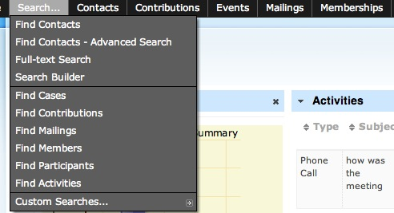
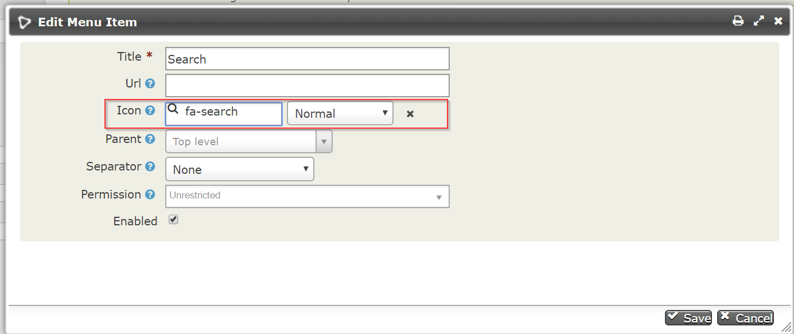
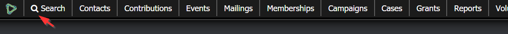
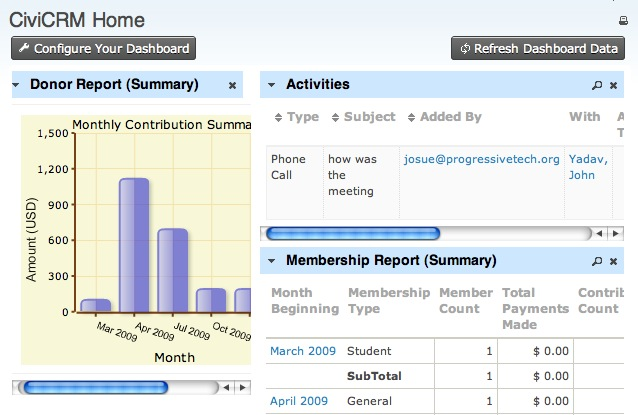
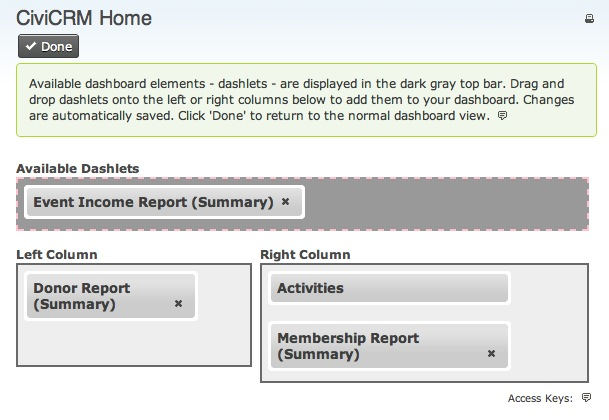

# Menu, Dashboard and Dashlets

This chapter gives an overview of CiviCRM's dashboard (its 'home page')
and the navigation menu available for people working in CiviCRM.

## The navigation menu

The navigation menu is a small bar at the top of every "back office"
page of CiviCRM.

It provides access to nearly every function of CiviCRM and is broadly
organised into headings by individual CiviComponents (such as
Contributions, Events and Mailings), with a few exceptions for Search
and Administer, both of which cover all of the enabled CiviComponents.

You can modify the navigation menu by going to: **Administer** >
**Customize** > **Navigation Menu** and then adding or rearranging menu
items on the screen.
 
You can also add icons to the navigation menu items. By editing the 
navigation menu item you will see a text input called (Icon):

You can click on the icon field and the icon-picker will appear allowing you to 
choose a desired icon : 

After refreshing the page, the icon will appear next to the navigation menu item:

Remember that changes you make to the navigation
menu will be seen by everyone who has the appropriate permissions to see
the menu, for better or for worse, so be careful when modifying the
navigation menu.

To the left of the navigation menu is the Quick search field. See the
chapter on Searching for more details. 

## The home dashboard & dashlets {:#dashlets}

When you first log into CiviCRM, the first page that you will see is the
dashboard (CiviCRM Home). The dashboard allows you to see important
information about your site and CiviCRM by displaying a series of
"dashlets". A dashlet is a report that you can display on your home
dashboard. Many dashlets come with CiviCRM by default, and you or your
administrator can create additional dashlets that are specific to your
organization's needs. Some examples of dashlets that come with CiviCRM
include:

-   Donor Report: a bar graph of the amount of total contributions per
    month for the last five months.
-   Activities: a list of recent activities that have been recorded by
    CiviCRM (this could include emails sent to constituents, donations
    that have been made, or meetings that have been scheduled in
    CiviCRM).
-   Membership Report: a table summarising information about Members
    tracked by CiviCRM and broken out by month. This includes the number
    of Members of each type, total amounts of payments made and the
    number of contributions made, among other things.

You can add these dashlets to your CiviCRM dashboard by clicking the
**Configure Your Dashboard** button. You will see a list of dashlets that
can be dragged into the right or left column of your dashboard.

Click **Done** to save the dashlets to your dashboard. From now on, you will
see updates to the status of your dashlets every time you log in (if
you'd like to check and see any changes that have occurred more
recently, you can always click **Refresh Dashboard Data** - this will reload
each dashlet and pull in any new information). For performance reasons, dashlets
are cached. You can change how often a dashlet refreshes by editing its report.
For example for the Contribution Summary report go to **Reports** >
**Contribution Reports** and click on **Contribution Summary**. Under the tab
**Access** you will find the **Cache dashlet for** option. If that option
is not available, first select the box that says **Available for Dashboard?**.
To save click on **Actions** > **Save**.

Almost any CiviCRM report can be made available as a dashlet.

To create a dashlet, do the following: 

-   Click **Reports** > **My Reports** and subsequently on the button
    **New Report**.
-   Select the report template that you want to use.
-   While here, configure the report via the tabs **Columns**, **Sorting**, and
    **Filters**. For example, you may want the report to always show data for
    "This Quarter" or "This Year". That is what the filter "Date Received" is for.
-   Click **View results**.
-   Choose between Tabular, Bar Chart, or Pie Chart via the dropdown box to the
    right of the Actions dropdown.
-   At the bottom of the **Access** tab, select the box that says
    **Available for Dashboard?**. Users with permissions to see that
    information will be able to add that dashlet. (See the section on [permissions](../initial-set-up/permissions-and-access-control.md) for more information).
-   Click **Actions** > **Create Report**.

Now add the dashlet to your dashboard: 

-   Click in the menu on the CiviCRM logo and then on **CiviCRM Home**
    to get to your dashboard.
-   Click **Configure Dashboard**. Drag the dashlet from the "Available
    Dashlets" box to the column where you'd like it to appear.
-   Click **Done**. 

(Refer to the section on [Reporting](../reporting/what-is-civireport.md) for more details on working with
reports.)
