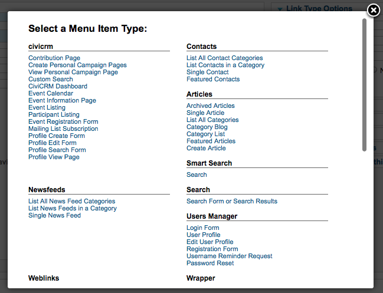
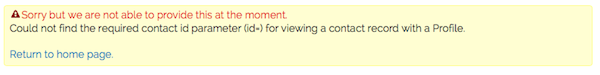

# Integrating with Joomla

CiviCRM integrates with Joomla! as a component. CiviCRM public forms
such as online contribution pages and event registration pages can be
exposed as menu items on the front-end of Joomla! sites, using your
selected theme. When logged in to your Administration site, CiviCRM
will be shown as a menu item under Components.

## Creating Joomla! Menu Items for CiviCRM Content

CiviCRM content can be displayed on your website in a couple of
different ways. The primary way is to create a specific Menu Item that
pulls in CiviCRM data. Within your Joomla! menu navigate to **Menu -> YourMenu -> Add New Menu Item**.

Once you are inside of the Edit Menu item screen you will then have the
option to select the menu item type. There will be a subsection called
civicrm with the below options.

After choosing one of the below you will then need to go to **Basic
Options**and select the corresponding CiviCRM page you wish to display.

-   **Contribution Page:** A specific contribution or membership page
    that you would like to publish on your website
-   **Create Personal Campaign Pages:**This type enables you to provide
    a direct link for an end users to create a personal campaign page
    that is tied to a specific contribution page for peer to peer
    fundraising. For instance, if you had an annual fundraiser called
    Support CiviCRM and you wanted to enable your constituents to raise
    money on your behalf you could create a Menu Item linking them
    directly
-   **View Personal Campaign Page:**
-   **Custom Search:**Customer Searches can be created
-   **CiviCRM Dashboard:**Selecting this option enables you to show an
    end user all of their related information i.e. previous
    contributions they have made, active and expired memberships, event
    registrations, etc. When selecting the CiviCRM Dashboard though you
    will want to ensure that the Access level for this menu item is set
    to Registered because CiviCRM need to know who exactly to display
    information about. Thus by setting it to registered it will force
    the end user to log in to be able to see their specific
    information.
-   **Event Calendar:**This option takes all of your current events and
    places them into a calendar view for your end user.
-   **Event Information Page:**This menu item type provides the summary
    information for the event that you have selected and then provides a
    link to directly register.
-   **Event Listing:**This type displays all of the upcoming events in a
    list format. You have the ability to sort by each of the columns
    however there is no search capability by default on the Event
    Listing
-   **Event Registration Form:**
-   **Participant Listing:**Dependent upon if you enabled a participant
    listing for your specific event you can display who will be
    attending your event by selecting this option.
-   **Mailing List Subscription:**If you have configured groups as
    mailing lists and have set the visibility to public you can enable
    your end users to sign up for these mailing lists on their own by
    selecting this menu item type.
-   **Profile Create Form:**You can collect information on your
    constiuents
-   **Profile Edit Form:**If an end user is logged into your site and
    you are presenting a Profile Edit Form they will have the ability to
    view the information that your organization has on record for them.
    In addition to that they will be able to edit that information and
    save it to CiviCRM. For instance if you are presenting the **New
    Individual** profile on your website as a Profile Edit Form, that
    end user who is logged in will then have the ability to view and
    update their first name, last name and email and save it to your
    CiviCRM instance.
-   **Profile Search Form:**If you have configured a profile as a
    standalone form or directory you have the ability to give an end
    user the ability to search your database via this specific profile.
    For instance, if you are a membership organization and you want to
    provide a directory of those members to the public, you could create
    a group called Members and then create a profile that limits the
    results of the search to only those individuals or organizations in
    that group.
-   **Profile View Form:**This menu item type allows you to display
    information that you have on record for a logged in user. For
    instance

## Access Levels with CiviCRM Menu Item Types

An important thing to consider is that some of the Menu item types above
require an end user to be logged into you site so that CiviCRM can know
which contact record's information should be presented. For example, if
John Smith comes to your website and is browsing without being logged in
and you have a **Profile View Form** specified to have the access level
of Public, CiviCRM will be completely unaware that John Smith is on your
site and thus not have the ability to display John Smith's personal
information back to him. In this scenario CiviCRM would present the
following error:

Every Joomla!
user that is created has a corresponding contact within CiviCRM. So when
someone logs in with their Joomla! credentials, CiviCRM can guarantee
which contact's information to display. The following CiviCRM Menu Item
types require an end user to be logged in to Joomla! and thus when
creating these specific types they should have a minimum Access level
set to Registered.

-   Profile Edit Form
-   Profile View Form
-   CiviCRM Dashboard

The availability of additional modules to extend and modify CiviCRM
behavior is fairly limited. However Joomla integrators have full access
to the CiviCRM API's and hook system, and there are a number of 3rd
party tools designed to solve specific problems and make customizations
easier. 

For more information, developers can refer to the [3rd party module
listing](http://wiki.civicrm.org/confluence/display/CRMDOC/Joomla!+Extensions+for+CiviCRM+%283rd+party%29) as well as the [Developer Guide](https://docs.civicrm.org/dev/en/latest).

## Configuration/Conflicts with Common Extensions

For the most part, CiviCRM is fairly self-contained inside Joomla and doesn't interact with other extensions except for those that are specifically intended to integrate with it (for example the 3rd party extensions list noted earlier) or occasionally system plugins that globally impact the entire site. However, there are times when specific extensions may require configuration adjustments to ensure CiviCRM is working properly. The list below details some common Joomla extensions you may want to review.

### AdminTools

[AdminTools]((https://extensions.joomla.org/extension/admin-tools/)) is a popular site security extension which includes a web application firewall and .htaccess builder, among other things. The .htaccess builder (available in the Pro version) provides extensive options through the user interface to build an .htaccess file that can significantly improve and harden your site security. However, some of the standard hardening options need adjustments in order to work well with CiviCRM. In particular, the .htaccess file includes directives to prevent direct access to all files and folders in your site, except the root `index.php`, `administrator/index.php`, and certain folders where allowable file types are permitted (primarily image files). In a standard Joomla+CiviCRM installation, a number of files are stored in the `/media/civicrm/ directory` which may require direct access. To permit access you must add several exclusions to the .htaccess builder.

Open the AdminTools .htaccess Maker and scroll down to the Exceptions section. Add the following exceptions to these fields:

* Allow direct access, except .php files, to these directories
    * `media/civicrm/persist/contribute/dyn/`
* Allow direct access, including .php files, to these directories
    * `administrator/components/com_civicrm/civicrm/extern/`
    * `administrator/components/com_civicrm/civicrm/bin/`
    * `administrator/components/com_civicrm/civicrm/packages/kcfinder/`

!!! note
    The above represents the standard directory paths where you will need to add exceptions. Depending on your configuration and use of the system, you may need to adjust the paths or add additional paths.
