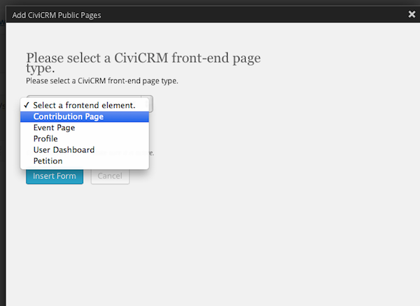

Intégration avec WordPress
==========================

Le plugin CiviCRM s'intègre avec WordPress à partir de la version 3.3.1 (ceux qui utilisent des versions antérieures de WordPress devront le mettre à jour avant).

Les formulaires publics de CiviCRM tels que les pages pour les contributions en ligne et celles pour l'inscription aux événements seront montrés au public avec le thème WordPress sélectionné.
Lorsque connecter, dans votre panneau de contrôle, le lien vers CiviCRCM sera affiché dans le menu latéral gauche.

###Synchroniser les utilisateurs de WordPress aux contacts de CiviCRM

CiviCRM offre une fonction pour synchroniser les utilisateurs avec les contacts: CiviCRM vérifiera si un dossier contact existe pour chaque utilisateur. Un nouveau dossier contact sera créé pour chaque nouvel utilisateur.  
Pour effectuer cette fonction aller à **Administrer -> Utilisateurs et permissions ->  Synchroniser les utilisateurs avec les contacts**.

Utilisation des "Shortcodes" pour publier le contenu de CiviCRM dans Wordpress
------------------------------------------------------------------------------

Les "Wordpress shortcodes" permet à un utilisateur d'afficher très facilement du contenu dynamique dans une page ou dans un "Post" Wordpress avec juste une ligne de texte. Pour plus d'informations, sur les "Wordpress shortcodes" voir http://en.support.wordpress.com/category/shortcodes/ 

Après l'installation de CiviCRM dans votre environnement Wordpress, vous pouvez immédiatement bénéficier des "shortcodes" définis pour CiviCRM qui permettent d'afficher ces contenus:

- Pages de contribution
- Pages d'événement
- Profils
- Tableau de bord utilisateur
- Pétitions

Avant d'être en mesure d'afficher tout contenu de CiviCRM sur le site Web public, il devra être déjà créé dans CiviCRM.

Pour ajouter un "shortcode" créez un nouveau "Post" ou une nouvelle page et vous verrez maintenant à côté d' "Ajouter le média", le bouton CiviCRM.

 

Après avoir cliqué sur CiviCRM, les options suivantes vous seront affichées:

 

Selon le "shortcode" que vous sélectionnez, vous aurez différentes sous-options pour répondre aux besoins d'information de l'utilisateur final.

Lors de sélection d'un élément "front end" de type **Page de contribution**, vous aurez la possibilité de sélectionner la page de contribution que vous voulez afficher, ensuite vous aurez la possibilité de choisir entre "Live" ou "Test mode".

Lors de la sélection de **Pages d'événement**, vous pouvez choisir une des deux options suivantes:

- Page d'information: En choisissant cette option, votre page Wordpress sera remplie avec des informations sommaires sur l'événement. Ce qui inclut la description, ainsi que la carte de l'emplacement si vous l'avez spécifié dans vos paramètres d'événement. En plus, il y a un bouton prévu sur la page d'information qui permettra à un utilisateur final de s'inscrire à l'événement.
- Page d'inscription: Cette option contourne les informations sommaires et affiche la page pour qu'un utilisateur final puisse s'inscrire à un événement précis.
    
**Pages profil**  Vous offre 3 options à choisir: Créer, Afficher et Modifier.

- Créer: Créé un formulaire en blanc sur votre site Web que l'utilisateur final peut compléter et sauvegarder. Les données seront écrites dans votre base de données de CiviCRM.

- Afficher: Si l'utilisateur final est connecté à Wordpress, vous pouvez afficher les informations conservées dans CiviCRM selon le profil. Par exemple, si vous affichez le profil "Nouvel individu" qui est constitué du Prénom, Nom et Adresse de courrier électronique, l'utilisateur final pourrait voir cette information.

- Modifier: Comme pour le mode "Afficher", si l'utilisateur final est connecté, vous pouvez afficher les informations conservées pour eux, mais aussi leur donner la possibilité les modifier. Par exemple, si un individu a récemment changé son nom ou son adresse de courrier électronique, il pourrait réviser l'information et la mettre à jour, et enregistrer l'information dans CiviCRM par le site Web.

Lors de la sélection de **Tableau de bord utilisateur**, il n'y a aucune option supplémentaire. Pour identifier les informations, vous devez définir ce qui sera affiché dans le tableau de bord de l'utilisateur (ex.: Contributions, Adhésions, etc.). Aller à **Administrer > Personnaliser les données et écrans > Préférences d'affichage**, ensuite sélectionner toutes les informations que vous souhaitez rendre visibles à l'utilisateur.

Finalement, pour les **Pétitions**, la seule option présente est de sélection la pétition que vous souhaitez afficher dans votre site Web.
